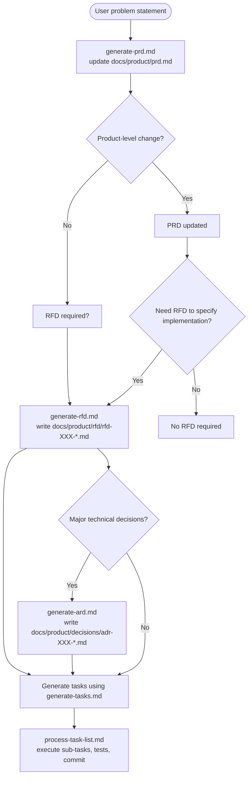

# 🚀 AI Dev Prompts — PRD / RFD / ARD / Tasks Flow

Welcome to **AI Dev Prompts**. This folder provides concise, opinionated prompts that implement a disciplined, auditable flow: convert a user problem statement into a PRD (or recommend an RFD), draft RFDs and ADRs for technical decisions, generate a task list, and execute tasks with approval gates, testing, and commits. Use these prompts in your AI-enabled IDE or CLI to run an end-to-end feature delivery workflow.

Use these structured prompts to break large requests into focused, verifiable steps.

## ✨ The Core Idea

Building complex features with AI can sometimes feel like a black box. This workflow aims to bring structure, clarity, and control to the process by:

1. **Defining Scope:** Clearly outlining what needs to be built with a Product Requirement Document (PRD).
2. **Detailed Planning:** Breaking down the PRD into a granular, actionable task list.
3. **Iterative Implementation:** Guiding the AI to tackle one task at a time, allowing you to review and approve each change.

This structured approach helps ensure the AI stays on track, makes it easier to debug issues, and gives you confidence in the generated code.

## Workflow: From Idea to Implemented Feature 💡➡️💻

Here's the step-by-step process using the prompt files in this folder. The files that exist in `docs/prompts/` are:

- `generate-prd.md` — Guidance and template for creating or updating the canonical PRD at `docs/product/prd.md`.
- `generate-rfd.md` — Guidance and template for creating RFDs (Request for Decision / Requirements for Design). Writes RFDs to `docs/product/rfd/` and updates the PRD's RFD register.
- `generate-tasks.md` — Convert an approved RFD into a detailed, actionable task list. Saves tasks to `docs/product/tasks/tasks-[rfd-file-name].md`.
- `process-task-list.md` — Protocol the AI must follow to execute task lists one sub-task at a time, run tests, and commit changes.
- `generate-ard.md` — Guidance and template for creating ARDs (Architecture / technical decisions). Writes ADRs to `docs/product/decisions/` and enforces ADR numbering.

New recommended flow (from user problem → code):

- **Problem statement → Create or update PRD**: Start with a user problem statement. Use `generate-prd.md` to either create a new PRD or update `docs/product/prd.md`. If the request is narrowly technical (APIs, DB, infra), `generate-prd.md` should recommend creating an RFD instead.
- **PRD → Draft RFD / ARD**: Use `generate-rfd.md` to produce a formal RFD under `docs/product/rfd/` and an ARD (Architecture / technical decisions) document if needed. The RFD prompt enforces filename numbering and updates the PRD's RFD register.
- **RFD → Tasks**: Use `generate-tasks.md` to convert the RFD into a `tasks-*.md` file under `docs/product/tasks/`. The prompt generates parent tasks, then waits for a "Go" confirmation before creating sub-tasks.
-- **Execute tasks**: Use `process-task-list.md` to run the tasks. The AI must follow the approval gate, mark sub-tasks complete, run tests, and commit changes according to the protocol.

## Visual flow

A compact, visual representation of the end-to-end flow implemented by these prompts:

```
[User problem statement]
        |
        v
[generate-prd.md] -> updates `docs/product/prd.md`
        |
        v
  Is this a product-level change?
    /            \
   yes            no
    |              |
    v              v
 [PRD updated]  [RFD required?]
    |              |
    |              v
    |        [generate-rfd.md] -> writes `docs/product/rfd/rfd-XXX-*.md`
    |              |
    |        (major technical decisions?)
    |              v
    |        [generate-ard.md] -> writes `docs/product/decisions/adr-XXX-*.md` (optional)
    |              |
    \______________/
           |
           v
 [generate-tasks.md] -> reads `docs/product/rfd/rfd-XXX-*.md` and writes `docs/product/tasks/tasks-*.md`
           |
           v
 [process-task-list.md] -> execute sub-tasks, run tests, commit
```



Use the diagram as a quick reference: start at the top with a concise problem statement and follow arrows to the appropriate prompt file to run next.

If you want me to update or add any of the prompt files (for example: add `create-prd.md`, a separate `generate-ard.md`, or change naming conventions), tell me which file(s) to create or modify and I will draft them.

The video and long tool-specific instructions have been removed to keep this README focused on the prompt files present in this folder and the recommended flow. If you want platform-specific snippets (Cursor, Claude, etc.) added back, say which platform and I will add concise instructions.


## Examples

Below are short examples showing how to call the prompts from an AI-enabled IDE or CLI.

- **Create or update PRD (`generate-prd.md`)**  
  Example (Agent chat):  
  ```text
  Use @generate-prd.md
  Problem statement: [Describe the user problem and goals]
  ```

- **Create an RFD (`generate-rfd.md`)**  
  Example (provide inputs):  
  ```text
  Use @generate-rfd.md
  Short title: Payment retries design
  Scope: How to handle transient payment failures
  Decisions: Retry policy, idempotency strategy
  ```

- **Create an ARD (`generate-ard.md`)**  
  Example:  
  ```text
  Use @generate-ard.md
  Short title: Choose message broker
  Scope: Selecting broker for event pipeline
  Constraints: 99.95% uptime, low latency
  ```

- **Generate tasks from an RFD (`generate-tasks.md`)**  
  Example (Agent):  
  ```text
  Take docs/product/rfd/rfd-001-payment-retries.md and generate tasks using @generate-tasks.md
  ```

- **Execute tasks (`process-task-list.md`)**  
  Example (start work):  
  ```text
  Please start on task 1.1 and use @process-task-list.md
  ```

## 💡 Tips for Success (short)

- **Provide a concise problem statement**: 1–2 sentences + clear acceptance criteria.
- **State the desired outcome & success metrics** so recommendations can be measured.
- **Declare scope and non-goals** to avoid ambiguous requests.
- **List data, constraints, and timelines** (performance, security, regulatory, deadlines).
- **Use PRD for product-level changes; use RFD/ARD for technical decisions.**
- **Confirm filenames and numbering rules** before generating RFDs/ADRs/tasks.


---

Happy AI-assisted developing!